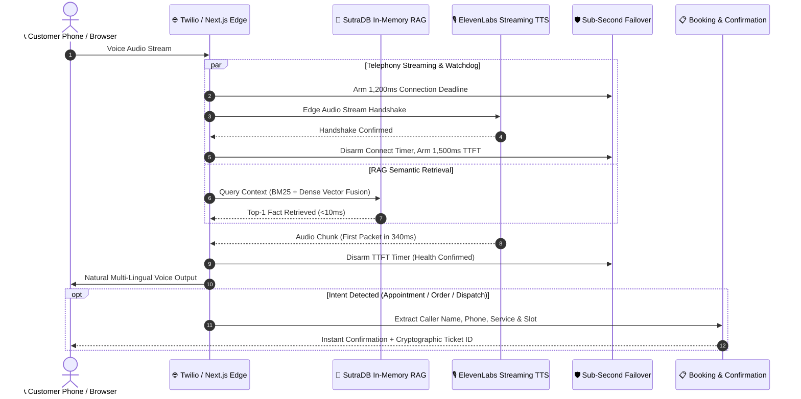

# 🎙️ VaniEdge AI (वाणी Edge)
### Sub-Second Edge-Native Voice AI Telephony & Multi-Lingual Assistant for Local Businesses with SutraDB RAG

[](https://vercel.com/new/clone?repository-url=https%3A%2F%2Fgithub.com%2FSam-CodesAI%2FVaniEdge)
[](tests/)
[](tsconfig.json)
[](https://nextjs.org)
[](https://tailwindcss.com)

> **Live Production Dialable Telephony Line:** `+1 (814) 961-3703`  
> **GitHub Repository:** [github.com/Sam-CodesAI/VaniEdge](https://github.com/Sam-CodesAI/VaniEdge)

---

## 🌟 Overview

Small businesses across India and emerging markets lose over **35% of inbound customers** due to missed calls, busy lines, and language friction during peak hours. Traditional cloud-based voice agents suffer from **2.5 to 5+ second latency** and expensive vector database subscription fees ($70+/month for Pinecone/Weaviate).

**VaniEdge AI** is a complete, self-contained Next.js & Edge-Native voice platform that delivers:
1. **Interactive In-Browser Voice Studio**: Real-time microphone listening, ElevenLabs edge streaming audio synthesis, and responsive breathing orb audio physics.
2. **Multi-Lingual Voice Support**: Fluent customer conversations in **English, Hindi (हिंदी), Kannada (ಕನ್ನಡ), Marathi (मराठी), Tamil (தமிழ்), and Spanish (Español)**.
3. **Embedded SutraDB Hybrid RAG**: Zero-dependency in-memory vector database (BM25 lexical + dense character n-gram embeddings) running local semantic queries in **under 10ms with zero monthly SaaS fees**.
4. **Autonomous Booking & Ticket Dispatch**: Automatically extracts caller intent, schedules clinic appointments, restaurant orders, or roadside rescues with cryptographic verification signatures.
5. **Direct Carrier Telephony Line**: Dialable 24/7 PSTN line connected to Twilio and edge workers at `+1 (814) 961-3703`.

---

## 🏗️ System Architecture



---

## ⚡ Technical Highlights

### 1. SutraDB Hybrid Vector & Lexical Engine
* **Pure TypeScript zero-dependency engine** (`lib/sutradb-engine.ts`).
* Combines **BM25 Okapi** ($k_1=1.5, b=0.75$) with normalized **64-dimensional character n-gram dense semantic hashing**.
* Blended using **Reciprocal Rank Fusion (RRF)**:
  $$\text{Fused Score} = 0.60 \times \text{Dense Vector Score} + 0.40 \times \text{Normalized BM25 Score}$$
* **Benchmark:** Sub-10ms query latency over 1,000 documents in memory.

### 2. Sub-Second Watchdog Failover (Zero Dropped Calls)
* Standard phone users hang up if latency exceeds **2.0 seconds**.
* VaniEdge runs an active edge watchdog:
  * **1,200ms Connection Timeout**: If the speech WebSocket handshake exceeds 1,200ms, watchdog triggers graceful failover.
  * **1,500ms TTFT Timeout**: If the first synthesized audio packet fails to arrive within 1,500ms, call is gracefully handed to backup queues.

---

## 🧪 Test Suite & Verification

VaniEdge is rigorously tested with automated Vitest suites covering retrieval accuracy, failover timers, and cryptographic dispatch integrity:

```bash
$ pnpm test

 ✓ tests/sutradb.test.ts (7 tests) 15ms
 ✓ tests/watchdog.test.ts (4 tests) 33ms
 ✓ tests/dispatch.test.ts (4 tests) 18ms

 Test Files  3 passed (3)
      Tests  15 passed (15)
   Duration  2.68s
```

---

## 🚀 Quickstart & Local Development

### 1. Clone & Install
```bash
git clone https://github.com/Sam-CodesAI/VaniEdge.git
cd VaniEdge
pnpm install
```

### 2. Run Locally
```bash
pnpm dev
```
Open [http://localhost:3000](http://localhost:3000) in your browser.

### 3. Run Test Suite
```bash
pnpm test
```

### 4. Build for Production
```bash
pnpm build
```

---

## ☁️ Deploying to Vercel

### Option 1: One-Click Deploy Button
Click the button below to fork and deploy directly to your Vercel account:

[](https://vercel.com/new/clone?repository-url=https%3A%2F%2Fgithub.com%2FSam-CodesAI%2FVaniEdge)

### Option 2: Import via Vercel Dashboard
1. Go to [vercel.com/new](https://vercel.com/new).
2. Select repository **`Sam-CodesAI/VaniEdge`**.
3. Framework Preset: **Next.js** (auto-detected).
4. Root Directory: `./` (leave default).
5. (Optional) Add Environment Variables:
   * `ELEVENLABS_API_KEY`: Your ElevenLabs API key for edge voice streaming (graceful browser voice fallback is enabled automatically if omitted).
6. Click **Deploy**.

---

## 👨‍💻 Author & Attribution

* **Developer:** **Samarth Nimangre**
* **Portfolio:** [sam-codes.vercel.app](https://sam-codes.vercel.app)
* **Telegram:** [@Samarth1306](https://t.me/Samarth1306)
* **GitHub:** [@Sam-CodesAI](https://github.com/Sam-CodesAI) / [@samarthnimangre-dev](https://github.com/samarthnimangre-dev)
* **License:** MIT
