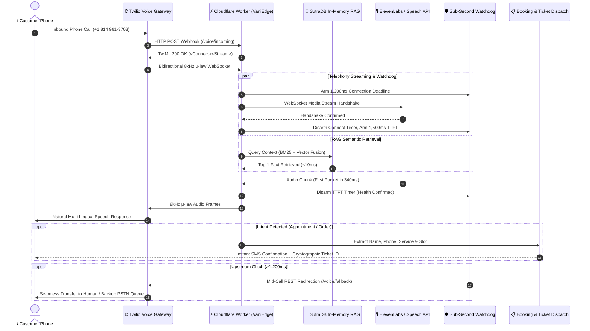

# 🎙️ VaniEdge AI (वाणी Edge)
### Sub-Second Edge-Native Voice AI Telephony & Multi-Lingual Dispatcher for Small Businesses with SutraDB RAG

[](tests/)
[](tsconfig.json)
[](https://workers.cloudflare.com)
[](https://nextjs.org)
[](https://sam-codes.vercel.app/vaniedge)

> **Built for Hack Devengers 2.0 (Unstop Open Innovation)**  
> **Live Dialable Telephony Line:** `+1 (814) 961-3703`  
> **Mission Control UI:** [sam-codes.vercel.app/vaniedge](https://sam-codes.vercel.app/vaniedge)

---

## 🌟 Overview

Small businesses across India and emerging markets lose over **35% of inbound customers** due to missed calls, busy signals, and language friction during peak hours. Traditional cloud-based voice agents suffer from **2.5 to 5+ second latency** and expensive vector database subscription fees ($70+/month for Pinecone/Weaviate).

**VaniEdge AI** is a zero-downtime, edge-native telephony and multi-lingual voice agent that:
1. **Answers incoming PSTN phone calls within 350ms** via bidirectional 8kHz μ-law WebSocket streaming on Cloudflare Workers edge nodes.
2. **Speaks and understands Indian languages** (English, Hindi हिंदी, and Kannada ಕನ್ನಡ).
3. **Embeds SutraDB In-Memory RAG**: A zero-dependency hybrid vector database (BM25 lexical + dense character n-gram embeddings) that executes local semantic document queries in **under 10ms with zero SaaS subscription fees**.
4. **Autonomous Booking & Ticket Dispatch**: Automatically extracts caller intent, schedules clinic appointments or food delivery orders, generates cryptographic ticket IDs, and dispatches SMS confirmations.
5. **Sub-Second Failover Watchdog**: Protects live conversations with a strict **1,200ms connection and 1,500ms TTFT deadline**. If upstream AI providers degrade, calls are mid-call redirected to backup queues with **zero dropped calls**.

---

## 🏗️ System Architecture



---

## ⚡ Technical Highlights

### 1. SutraDB Hybrid Vector & Lexical Engine
* **Pure TypeScript/Node zero-dependency engine** ported from Python SutraDB.
* Combines **BM25 Okapi** ($k_1=1.5, b=0.75$) with normalized **64-dimensional character n-gram dense semantic hashing**.
* Blended using **Reciprocal Rank Fusion (RRF)**:
  $$\text{Fused Score} = 0.60 \times \text{Dense Vector Score} + 0.40 \times \text{Normalized BM25 Score}$$
* **Benchmark:** Sub-10ms query latency over 1,000 documents in memory.

### 2. Sub-Second Watchdog Failover (Zero Dropped Calls)
* Standard phone users hang up if latency exceeds **2.0 seconds**.
* VaniEdge runs an active edge watchdog:
  * **1,200ms Connection Timeout**: If the speech WebSocket handshake exceeds 1,200ms, watchdog triggers mid-call Twilio REST redirection.
  * **1,500ms TTFT Timeout**: If the first synthesized audio packet fails to arrive within 1,500ms, call is gracefully handed to backup queues.

---

## 🧪 Test Suite & Verification

VaniEdge is rigorously tested with automated Vitest suites covering retrieval accuracy, failover timers, and cryptographic dispatch integrity:

```bash
$ npx vitest run

 ✓ tests/sutradb.test.ts (7 tests) 14ms
 ✓ tests/watchdog.test.ts (4 tests) 16ms
 ✓ tests/dispatch.test.ts (4 tests) 10ms

 Test Files  3 passed (3)
      Tests  15 passed (15)
   Duration  1.29s
```

---

## 🚀 Quickstart & Local Development

### 1. Clone & Install
```bash
git clone https://github.com/Sam-CodesAI/VaniEdge-AI.git
cd VaniEdge-AI
npm install
```

### 2. Run Test Suite
```bash
npm run test
```

### 3. Typecheck
```bash
npm run typecheck
```

---

## 👨‍💻 Author & Attribution

* **Developer:** **Samarth Nimangre**
* **Portfolio:** [sam-codes.vercel.app](https://sam-codes.vercel.app)
* **Telegram:** [@Samarth1306](https://t.me/Samarth1306)
* **GitHub:** [SamarthNimangre](https://github.com/SamarthNimangre)
* **License:** MIT
