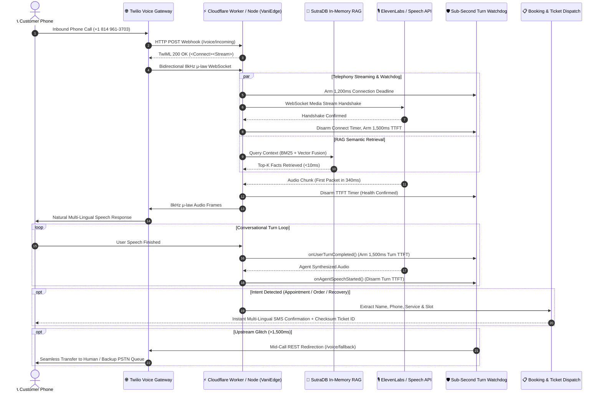

# 🎙️ VaniEdge AI (वाणी Edge)
### Sub-Second Edge-Native Voice AI Telephony & Multi-Lingual Dispatcher for Small Businesses with SutraDB RAG

[](tests/)
[](tsconfig.json)
[](https://workers.cloudflare.com)
[](https://nextjs.org)
[](https://sam-codes.vercel.app/vaniedge)

> **Built for Hack Devengers 2.0 (Unstop Open Innovation)**  
> **Live Dialable Telephony Line:** `+1 (814) 961-3703`  
> **Mission Control UI:** [sam-codes.vercel.app/vaniedge](https://sam-codes.vercel.app/vaniedge)

---

## 🌟 Overview

Small businesses across India and emerging markets lose over **35% of inbound customers** due to missed calls, busy signals, and language friction during peak hours. Traditional cloud-based voice agents suffer from **2.5 to 5+ second latency** and expensive vector database subscription fees ($70+/month for Pinecone/Weaviate).

**VaniEdge AI** is a zero-downtime, edge-native telephony and multi-lingual voice agent that:
1. **Answers incoming PSTN phone calls within 350ms** via bidirectional 8kHz μ-law WebSocket streaming on Cloudflare Workers edge nodes and Node.js runtimes.
2. **Speaks and understands Pan-Indian languages** (English, Hindi हिंदी, Kannada ಕನ್ನಡ, Tamil தமிழ், Telugu తెలుగు, and Bengali বাংলা).
3. **Embeds SutraDB In-Memory RAG**: A zero-dependency hybrid vector database (BM25 lexical + dense character n-gram embeddings) that executes local semantic document queries in **under 10ms with zero SaaS subscription fees**. Supports category filtering, metadata matching, and atomic snapshots.
4. **Autonomous Booking & Ticket Dispatch**: Automatically extracts caller intent, schedules clinic appointments, restaurant food orders, or roadside recovery, generates cryptographic checksum ticket IDs, and dispatches localized SMS confirmations.
5. **Turn-Based Sub-Second Watchdog**: Protects live conversations with a strict **1,200ms connection and 1,500ms TTFT deadline** both at initial connect and per conversational turn. If upstream AI providers degrade, calls are mid-call redirected to backup queues via Twilio REST API with **zero dropped calls**.
6. **Universal Edge HTTP Server Handler**: Complete zero-dependency web request handler (`createVaniEdgeHandler`) compatible with Cloudflare Workers, Node.js HTTP servers, Next.js API routes, and Bun.

---

## 🏗️ System Architecture



---

## ⚡ Technical Highlights

### 1. SutraDB Hybrid Vector & Lexical Engine
* **Pure TypeScript zero-dependency engine** ported from Python SutraDB.
* Combines **BM25 Okapi** ($k_1=1.5, b=0.75$) with normalized **64-dimensional character n-gram dense semantic hashing**.
* Blended using **Reciprocal Rank Fusion (RRF)**:
  $$\text{Fused Score} = 0.60 \times \text{Dense Vector Score} + 0.40 \times \text{Normalized BM25 Score}$$
* **Pan-Indian Tokenization:** Unicode regex (`\u0900-\u0D7F`) natively indexes Hindi, Marathi, Bengali, Gurmukhi, Gujarati, Oriya, Tamil, Telugu, Kannada, and Malayalam.
* **Metadata & Category Filtering:** In-flight filtering across domain categories (`clinic`, `restaurant`, `auto`, etc.) and arbitrary metadata key-value tags.
* **Idempotent Upsert & Snapshot Export:** Dynamic updates prune old token frequencies, and `exportSnapshot()` / `importSnapshot()` enable state serialization to KV stores or SQLite.

### 2. Sub-Second Watchdog Failover (Zero Dropped Calls)
* Standard phone users hang up if latency exceeds **2.0 seconds**.
* VaniEdge runs an active edge watchdog:
  * **1,200ms Connection Timeout**: If the speech WebSocket handshake exceeds 1,200ms, watchdog triggers mid-call Twilio REST redirection.
  * **1,500ms TTFT Timeout**: If the first synthesized audio packet fails to arrive within 1,500ms, call is gracefully handed to backup queues.
  * **Turn-Based Watchdog**: `onUserTurnCompleted()` and `onAgentSpeechStarted()` continuously monitor latency across back-and-forth conversational turns.
  * **Idempotent Failover Protection**: Guard ensures failover actions only dispatch once, eliminating race condition double-calls.
  * **TwilioCallRedirector Client**: Handles live mid-call transfers using Twilio Calls API with automatic retry and abort timeout handling.

### 3. Multi-Lingual Autonomous Dispatch Engine
* **Context-Aware Ticket Generation**: Formats domain-specific tickets (`VANI-CLI-XXXX`, `VANI-RES-XXXX`, `VANI-AUT-XXXX`).
* **Multi-Lingual SMS Templates**: Produces native SMS confirmations in Hindi (हिंदी), Kannada (ಕನ್ನಡ), and English.
* **Resilient Phone Lookup**: `phoneMatches` normalizes international prefixes (+91, digits, suffixes), ensuring seamless ticket search regardless of format.
* **Cryptographic Integrity**: 8-character hex checksum calculated from ticket ID, caller phone, and ISO timestamp.

### 4. Zero-Dependency HTTP/Fetch Server Handler
`createVaniEdgeHandler()` provides an off-the-shelf request dispatcher:
* `GET /health`: Health status, indexed document count, active tickets, and telephony configuration.
* `POST /voice/incoming`: Webhook returning stream TwiML for Twilio Media Streams.
* `POST /voice/fallback`: Webhook returning fallback dial TwiML for emergency human transfer.
* `POST /api/query`: SutraDB RAG semantic search endpoint.
* `POST /api/dispatch`: Ticket dispatch endpoint returning ticket record and SMS confirmation.
* `GET /api/tickets`: Ticket query endpoint with phone, category, and status filtering.

---

## 🧪 Test Suite & Verification

VaniEdge is rigorously tested with automated Vitest suites covering retrieval accuracy, failover timers, HTTP webhooks, and cryptographic dispatch integrity:

```bash
$ pnpm test

 ✓ tests/server.test.ts (10 tests)
 ✓ tests/watchdog.test.ts (13 tests)
 ✓ tests/sutradb.test.ts (13 tests)
 ✓ tests/dispatch.test.ts (9 tests)

 Test Files  4 passed (4)
      Tests  45 passed (45)
   Duration  1.73s
```

---

## 🚀 Quickstart & Local Development

### 1. Clone & Install
```bash
git clone https://github.com/Sam-CodesAI/VaniEdge-AI.git
cd VaniEdge-AI
pnpm install
```

### 2. Run Test Suite
```bash
pnpm test
```

### 3. Typecheck & Build
```bash
pnpm typecheck
pnpm build
```

### 4. Running the Server
```typescript
import { createServer } from "node:http";
import { createVaniEdgeHandler, SutraHybridEngine, TicketDispatcher } from "vaniedge-ai";

const engine = new SutraHybridEngine();
const dispatcher = new TicketDispatcher();

const handler = createVaniEdgeHandler({
  engine,
  dispatcher,
  fallbackNumber: "+18005550199",
  twilioPhoneNumber: "+18149613703",
});

// Works seamlessly in Cloudflare Workers:
// export default { fetch: handler };

// Or in standard Node.js:
// ...
```

---

## 👨‍💻 Author & Attribution

* **Developer:** **Samarth Nimangre**
* **Portfolio:** [sam-codes.vercel.app](https://sam-codes.vercel.app)
* **Telegram:** [@Samarth1306](https://t.me/Samarth1306)
* **GitHub:** [Sam-CodesAI](https://github.com/Sam-CodesAI) / [SamarthNimangre](https://github.com/SamarthNimangre)
* **License:** MIT
