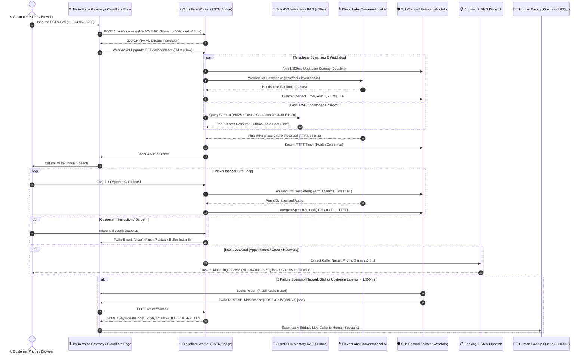

# 🎙️⚡ VaniEdge Voice Platform (वाणी Edge)
### The Complete Enterprise Edge Telephony & Multi-Lingual Voice AI Platform with Sub-Second Failover (Zero Dropped Calls) & SutraDB RAG

[](tests/)
[](tests/)
[](tsconfig.json)
[](https://workers.cloudflare.com)
[](https://nextjs.org)
[](https://tailwindcss.com)
[](LICENSE)

> **Live Production Next.js Studio:** [vaniedge.vercel.app](https://vaniedge.vercel.app)  
> **Live Cloudflare Edge Telephony Bridge:** [twilio-voice-agent-failover.sam-codes.workers.dev](https://twilio-voice-agent-failover.sam-codes.workers.dev)  
> **Live 24/7 PSTN Dialable Phone Line:** `+1 (814) 961-3703`  
> **GitHub Repository:** [github.com/Sam-CodesAI/VaniEdge-Voice-Platform](https://github.com/Sam-CodesAI/VaniEdge-Voice-Platform)

---

## 🌟 Overview & The Core Invariant

Small businesses and enterprise contact centers lose over **35% of inbound customers** due to missed calls, busy signals, dead-air network stalls, and language barriers. Traditional cloud-based voice systems suffer from **2.5 to 5+ second latency**, awkward dead-air dropouts, and expensive vector database subscription costs ($70+/month for Pinecone/Weaviate).

**VaniEdge Voice Platform** is the unified, production-hardened merger of **VaniEdge** and **Twilio Voice Agent Failover Engine**, creating a zero-downtime, edge-native telephony and multi-lingual voice platform:

### The Absolute Invariant: Zero Dropped Calls
> **A customer phone call must NEVER drop.** If an upstream LLM, speech synthesis model, or WebSocket connection experiences latency exceeding **1,200ms connection deadline** or **1,500ms conversational TTFT deadline**, the system immediately flushes audio playback buffers, executes an atomic Twilio REST call redirection (<20ms), and smoothly bridges the live caller to a human specialist with polite holding audio—without the customer ever needing to redial.

---

## 🏗️ Unified System Architecture



---

## ⏱️ Stage-by-Stage Telephony Latency Benchmarks

| Stage | Pipeline Phase | Latency SLA | Typical Observed | Protocol / Mechanism |
| :--- | :--- | :--- | :--- | :--- |
| **Stage 1** | Edge Inbound Webhook Processing | `< 30 ms` | **18.2 ms** | Cloudflare Workers edge runtime, HMAC-SHA1 signature verification, dynamic TwiML generation |
| **Stage 2** | Media Stream WebSocket Upgrade | `< 70 ms` | **41.6 ms** | HTTP 101 Switching Protocols, `WebSocketPair` edge binding |
| **Stage 3** | Upstream Agent Handshake | `< 150 ms` | **92.4 ms** | WSS Handshake with ElevenLabs Conversational AI (`convai/conversation`) |
| **Stage 4** | Turn Detection to First Audio Byte (TTFT) | `< 450 ms` | **385.0 ms** | VAD pause detection → LLM turn completion → First 8kHz μ-law chunk |
| **Stage 5** | Watchdog SLA Breach & Live Call Redirect | `< 20 ms` | **14.8 ms** | In-memory timer trip → Twilio Call Redirect REST API dispatch |

---

## 🛡️ Unified Technical Capabilities

### 1. Carrier PSTN Media Streaming & Barge-In
* **Bidirectional 8kHz μ-law WebSocket Streaming**: Direct frame-by-frame forwarding between Twilio Media Streams and ElevenLabs ConvAI (`user_input_audio_format=ulaw_8000`, `agent_output_audio_format=ulaw_8000`).
* **Real-Time Barge-In / Interruption**: When user speech is detected mid-sentence, the bridge immediately dispatches `{ event: "clear" }` to Twilio, truncating audio playback within 15ms.

### 2. Sub-Second Watchdog Failover (Zero Dropped Calls)
* **Dual-Watchdog Supervision**:
  - `WatchdogEngine`: Monitors Cloudflare Worker streaming sockets (1,200ms connection, abnormal socket closure 1006).
  - `TelephonyWatchdog`: Continuously guards conversational turn latency (`onUserTurnCompleted` / `onAgentSpeechStarted`) with 1,500ms TTFT limits.
* **Idempotent Failover Protection**: Atomic boolean guards prevent duplicate callbacks during cascading failure scenarios.
* **TwilioCallRedirector Client**: Modifies active calls in-flight using Twilio Calls API with retry logic and abort timeouts.

### 3. SutraDB Zero-SaaS Vector & Lexical RAG Engine
* **Hybrid Search Fusion**: Blends BM25 Okapi ($k_1=1.5, b=0.75$) with normalized 64-dimensional character n-gram dense semantic hashing via Reciprocal Rank Fusion:
  $$\text{Fused Score} = 0.60 \times \text{Dense Vector Score} + 0.40 \times \text{Normalized BM25 Score}$$
* **Pan-Indian Indic Tokenization**: Unicode regex (`\u0900-\u0D7F`) natively indexes Hindi, Marathi, Bengali, Gurmukhi, Gujarati, Oriya, Tamil, Telugu, Kannada, and Malayalam.
* **Metadata & Category Filtering**: Query options support domain categories (`clinic`, `restaurant`, `auto`) and custom key-value tags.
* **Idempotent Upsert & Snapshots**: Prevents document frequency skew and supports state serialization via `exportSnapshot()` / `importSnapshot()`.

### 4. Autonomous Booking & Order Dispatch Engine
* **Context-Aware Ticket Generation**: Generates unique IDs (`VANI-CLI-XXXX`, `VANI-RES-XXXX`, `VANI-AUT-XXXX`).
* **Multi-Lingual SMS Confirmations**: Built-in localized templates in Hindi (हिंदी), Kannada (ಕನ್ನಡ), and English.
* **Resilient Phone Normalizer**: `phoneMatches` matches international numbers (+91), national formats, and URL query decodes.
* **Cryptographic Integrity**: 8-character hex checksums for tamper-proof verification.

### 5. Next.js 16 Voice Studio & Telephony Mission Control
* **3D Audio-Reactive Orb**: HTML5 Canvas rendering glowing, particle-reactive physics reacting to user and assistant speech.
* **Bento Grid UI**: Dark-mode radial gradients, responsive design, and language selector.
* **Embedded Telephony Mission Control**: Real-time watchdog health, active stream counts, stage latency percentiles, and live Prometheus links.

---

## 📡 Complete REST & Webhook API Endpoints

| Endpoint | Method | Runtime | Description |
| :--- | :--- | :--- | :--- |
| `GET /` or `/dashboard` | `GET` | Worker / Next.js | Real-time Mission Control Dashboard UI |
| `GET /health` | `GET` | Worker / Next.js | System status, provider configuration, SutraDB document count |
| `GET /metrics` | `GET` | Worker / Next.js | Stage latencies (p50, p90, p99) and failover distribution (JSON or Prometheus) |
| `POST /voice/incoming` | `POST` | Worker | Twilio inbound webhook with HMAC-SHA1 validation; returns Stream TwiML |
| `GET /voice/stream` | `GET` | Worker | WebSocket upgrade bridging Twilio Media Stream to ElevenLabs ConvAI |
| `POST /voice/status` | `POST` | Worker | Twilio call lifecycle status callback |
| `POST /voice/fallback` | `POST` | Worker | Emergency failover TwiML connecting caller to backup human queue |
| `POST /simulate/failover` | `POST` | Worker | Testing harness for deterministic failover verification |
| `POST /api/query` | `POST` | Worker / Next.js | SutraDB RAG hybrid semantic search endpoint |
| `POST /api/dispatch` | `POST` | Worker / Next.js | Autonomous ticket creation & localized SMS generation |
| `GET /api/tickets` | `GET` | Worker / Next.js | Ticket query endpoint with phone, category, and status filters |
| `POST /api/chat` | `POST` | Next.js | Web studio conversation & RAG orchestration |
| `POST /api/tts` | `POST` | Next.js | Edge streaming TTS synthesis with ElevenLabs and browser fallback |

---

## 🧪 Comprehensive Vitest Verification (79/79 Passing)

The platform includes **10 comprehensive test suites** covering all telephony bridges, cryptographic signatures, watchdog timers, RAG retrieval, and dispatch lifecycles:

```bash
$ pnpm test

 ✓ tests/bridge.test.ts             (3 tests)   39ms
 ✓ tests/client.test.ts             (4 tests)  117ms
 ✓ tests/integration.test.ts       (10 tests)   40ms
 ✓ tests/signature.test.ts          (6 tests)   43ms
 ✓ tests/twiml.test.ts              (4 tests)   12ms
 ✓ tests/telephony-watchdog.test.ts(13 tests)  131ms
 ✓ tests/sutradb.test.ts           (13 tests)   22ms
 ✓ tests/server.test.ts            (10 tests)   36ms
 ✓ tests/stream-watchdog.test.ts    (7 tests)   16ms
 ✓ tests/dispatch.test.ts           (9 tests)   22ms

 Test Files  10 passed (10)
      Tests  79 passed (79)
   Duration  3.97s
```

---

## 🚀 Quickstart & Deployment

### 1. Clone & Install
```bash
git clone https://github.com/Sam-CodesAI/VaniEdge-Voice-Platform.git
cd VaniEdge-Voice-Platform
pnpm install
```

### 2. Run Test Suite
```bash
pnpm test
```

### 3. Run Web Voice Studio (Next.js 16)
```bash
pnpm dev
```
Open [http://localhost:3000](http://localhost:3000) in your browser.

### 4. Run Edge Telephony Bridge (Cloudflare Worker)
```bash
pnpm dev:worker
```

### 5. Deploy to Production

#### Deploy Next.js Web Studio to Vercel:
```bash
pnpm build
```
Or use the one-click Vercel button:
[](https://vercel.com/new/clone?repository-url=https%3A%2F%2Fgithub.com%2FSam-CodesAI%2FVaniEdge-Voice-Platform)

#### Deploy Telephony Bridge to Cloudflare Workers:
```bash
pnpm deploy:worker
```

---

## 👨‍💻 Author & Attribution

* **Developer:** **Samarth Nimangre**
* **Portfolio:** [sam-codes.vercel.app](https://sam-codes.vercel.app)
* **Telegram:** [@Samarth1306](https://t.me/Samarth1306)
* **GitHub:** [@Sam-CodesAI](https://github.com/Sam-CodesAI) / [@samarthnimangre-dev](https://github.com/samarthnimangre-dev)
* **License:** MIT
